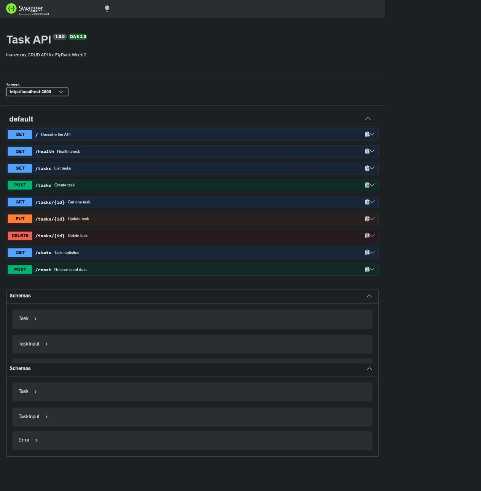

# Week 2 — In-memory Task CRUD API

Express API for full task CRUD. Data intentionally lives only in memory. The
API includes validation, correct HTTP statuses, JSON errors, Swagger UI,
search/filter/stats/reset extras, and automated tests.

```bash
npm install
npm start -w week-02-task-api
```

Open <http://localhost:3000/docs> for Swagger UI.

| Method | Path | Success | Errors |
| --- | --- | --- | --- |
| GET | `/`, `/health` | 200 | — |
| GET | `/tasks`, `/tasks/:id` | 200 | 404 unknown ID |
| POST | `/tasks` | 201 | 400 invalid title |
| PUT | `/tasks/:id` | 200 | 400 invalid body, 404 unknown ID |
| DELETE | `/tasks/:id` | 204 | 404 unknown ID |
| GET | `/stats` | 200 | — |
| POST | `/reset` | 200 | — |

```bash
curl -i -X POST http://localhost:3000/tasks -H "Content-Type: application/json" -d '{"title":"Buy milk"}'
```

Verified local responses from the complete cycle:

```text
POST /tasks      HTTP/1.1 201 Created
GET /tasks/3     HTTP/1.1 200 OK
PUT /tasks/3     HTTP/1.1 200 OK
DELETE /tasks/3  HTTP/1.1 204 No Content
GET /tasks/999   HTTP/1.1 404 Not Found
                 {"error":"Task 999 not found"}
```

The full response headers and bodies were checked on 2 September 2026. Run
`npm test -w week-02-task-api` for the repeatable CRUD and validation checks.
The saved terminal evidence is in [`curl-output.txt`](./curl-output.txt).

## Mortality experiment

Created tasks disappear when Node restarts because the array exists only in
process memory. Week 3 replaces this store behind the same routes with a
persistent database.

## Screenshot evidence

The following screenshot was captured from the running local API and shows all
documented CRUD operations plus stats and reset. Browser console errors: zero.


