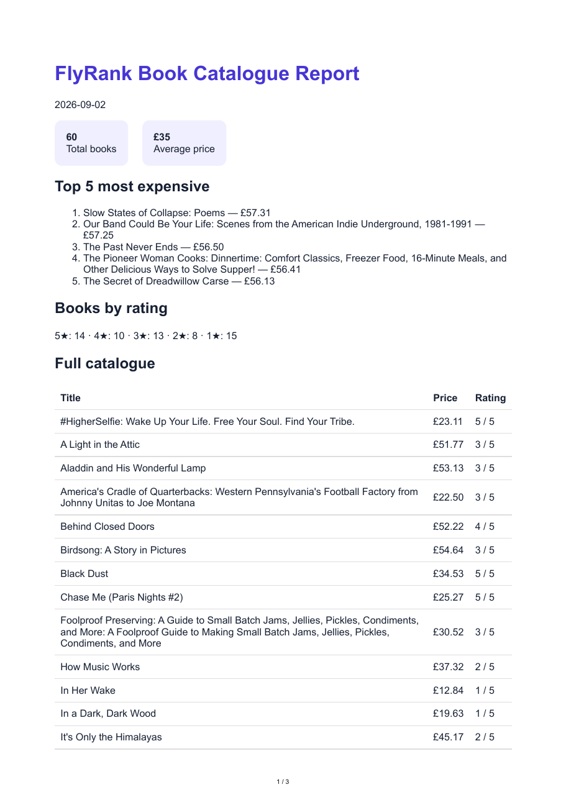

# Week 7 — PDF Report Generator

This bookstore report reuses the 60 validated Week 5 records. Run `npm run seed` (safe twice), `npx playwright install chromium`, then `npm start` on port 3005.

Aggregation SQL:

```sql
SELECT COUNT(*) total_books, ROUND(AVG(price),2) average_price FROM books;
SELECT title,price,rating FROM books ORDER BY price DESC LIMIT 5;
SELECT rating,COUNT(*) count FROM books GROUP BY rating ORDER BY rating DESC;
```

`POST /reports` returns 201 with an ID and `/reports/:id/file`; `GET /reports/:id` returns metadata; the file endpoint alone sends PDF bytes. `GET` with an unknown ID returns 404. The PDF includes totals, top five, rating groups and all 60 books, so it spans at least two pages. Print CSS prevents split rows and repeats `<thead>`.

Two same-day POSTs return the same ID and create one file (201 then 200); `{ "force": true }` creates a new one. This protects against double-clicks. Without it, a paid invoice/report renderer could charge twice and send duplicated artifacts. Move generation to a background job when data volume makes the visible synchronous pause unacceptable; that improves response time but adds status, retries, and worker operations.

Proof commands: `curl -X POST http://localhost:3005/reports`, then `curl -o report.pdf http://localhost:3005/reports/ID/file`. Generated `report.db` and `reports/` are gitignored recipes, not committed artifacts.


